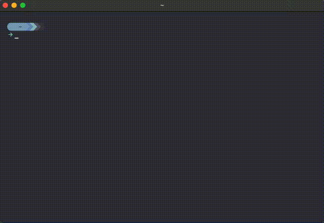

<div align="center">
<h1>✨ CCSDS (Decoder/Encoder)</h1>
<p align="center">
<a href="https://github.com/shaneyost/ccsds-hdr.nvim/actions/workflows/ci.yaml">

</a>
<a href="https://github.com/shaneyost/ccsds-hdr.nvim/blob/main/LICENSE">

</a>
<a href="https://github.com/shaneyost/ccsds-hdr.nvim/issues">

</a>
</p>
</div>

## About  

**ccsds-hdr.nvim** is a neovim plugin for working w/ the [**CCSDS Space Packet Protocol**](https://www.google.com/url?sa=t&source=web&rct=j&opi=89978449&url=https://public.ccsds.org/Pubs/133x0b2e2.pdf&ved=2ahUKEwigqvPy2OuLAxWYGDQIHX1dAbkQFnoECA4QAQ&usg=AOvVaw2MNioMmgO_qpa6XMpMHKwA). This tool is built to handle the following tasks with clarity and ease.

- **Decode a 6-byte primary header** into its individual CCSDS fields
- **Encode a 6-byte primary header** from user-inputted field values
- **Enforce validation on fields** through range checks
- **Visualize changes** from one CCSDS header to the next

<p align="center">
  
</p>

## Configuration

```lua
return {
    "shaneyost/ccsds-hdr.nvim",
    config = function()
        local ccsds = require("ccsds-hdr")
        -- Key map that triggers the encoder on demand
        vim.keymap.set("n", "<leader>ce", ccsds.parser.animate_encode, {
            noremap = true,
            silent = true,
            desc = "ccsds-hdr encode",
        })
        -- Key map that triggers the decoder on demand
        vim.keymap.set("n", "<leader>cd", ccsds.parser.animate_decode, {
            noremap = true,
            silent = true,
            desc = "ccsds-hdr decode",
        })
        -- Key map that triggers the tool to open
        vim.keymap.set("n", "<leader>co", ccsds.ui.open, {
            noremap = true,
            silent = true,
            desc = "ccsds-hdr open",
        })
        -- Key map that switches you between encoder/decoder windows
        vim.keymap.set("n", "<leader>cn", ccsds.ui.swap, {
            noremap = true,
            silent = true,
            desc = "ccsds-hdr next",
        })
        -- Key map that triggers the tool to close
        vim.keymap.set("n", "<leader>cc", ccsds.ui.close, {
            noremap = true,
            silent = true,
            desc = "ccsds-hdr close",
        })
        ccsds.setup({
        -- Title of the Encoder window (shows up in top center)
        encoder_title = "Encoded",
        -- Title of the Decoder window (shows up in top center)
        decoder_title = "Decoded",
        -- Initial values for encoder
        initial_encoder_vals = { string.format("0A 0B C4 01 37 9A") },
        -- Initial values for decoder
        initial_decoder_vals = {
            string.format("Packet Version: 0"),
            string.format("Packet Type: 0"),
            string.format("Secondary Header: 1"),
            string.format("Application ID: 0x20B"),
            string.format("Sequence Flag: 3"),
            string.format("Sequence Count: 1025"),
            string.format("Data Length: 14234"),
        },
        -- Highlights applied for bytes/fields updated after decoding/encoding
        hl_update_color = { fg = "#2E3440", bg = "#88C0D0", bold = false },
        -- Highlights applied for bytes/fields that are invalid after decoding/encoding
        hl_errors_color = { fg = "#2E3440", bg = "#D08770", bold = false },
        -- Highlights applied for bytes/fields overall
        hl_normal_color = { fg = "#D8DEE9", bg = "#2E3440", bold = false },
        -- Highlights applied for all borders of encoder/decoder windows
        hl_border_color = { fg = "#88C0D0", bold = false },
        })
    end,
}
```
